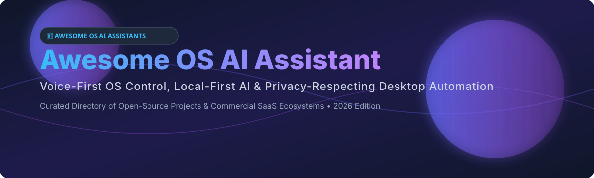

# Awesome OS AI Assistant 🤖💬

  

  
  
  
  
  

## 🌟 Top OS AI Assistant Ecosystem

**Curated List of SaaS Products & Open-Source GitHub Projects**  
*Focused on Voice-First OS Control, Local-First AI, Speech Recognition (STT), Text-to-Speech (TTS) & Privacy-Respecting Desktop Automation Assistants*  

📅 **Last updated: October 2026**

---

### 📌 Overview

This repository tracks notable **commercial OS AI assistants** and **open-source projects** that bring voice control, desktop automation, LLM tool execution, and conversational AI to operating systems (Windows, macOS, Linux, Android). These solutions range from cloud-dependent commercial products like Siri and Microsoft Copilot to fully local, privacy-first open-source frameworks running entirely on your hardware.

* **Commercial Leaders**: Microsoft Copilot in Windows, Apple Intelligence & Siri, Google Assistant / Gemini, Amazon Alexa, Bixby, and Braina.
* **Open-Source Leaders**: Open Interpreter, Home Assistant Assist, Rasa, Leon, Pipecat, Willow, and OpenVoiceOS (OVOS).

🤝 **Contributions welcome!** Open a PR to add or update entries. Keep descriptions factual and link to official project repositories.

---

## 📑 Table of Contents

- [☁️ SaaS / Hosted Platforms](#%EF%B8%8F-saas--hosted-platforms)
- [🔓 Open-Source GitHub Projects](#-open-source-github-projects)
- [🤝 How to Contribute](#-how-to-contribute)
- [⚠️ Disclaimer](#%EF%B8%8F-disclaimer)
- [📈 Star History](#-star-history)
- [💖 Support & Sponsorship](#-support--sponsorship)

---

## ☁️ SaaS / Hosted Platforms

💡 *Market Context: The global OS AI Assistant & Desktop Automation market is estimated at **$12.5 Billion in 2026** (growing at ~32% CAGR towards $45B+ by 2030). The sector is **highly concentrated** (winner-take-all dynamics dominated by big tech operating system owners like Apple, Microsoft, Google, and Amazon).*

| 🚀 Product | 🏢 Company Size / Valuation | 💰 Pricing | 🎁 Free Tier Limit | 📝 Description |
| :--- | :--- | :--- | :--- | :--- |
| **[Apple Intelligence & Siri](https://www.apple.com/apple-intelligence/)** | ~$3.2 Trillion Valuation (Revenue: ~$385B/yr) | Included with Apple Hardware (Paid tiers via ChatGPT Plus integration: $20.00/mo) | Unlimited basic Siri & on-device Apple Intelligence features included free forever on eligible devices (iPhone 15 Pro+, M-series Macs) | **Apple's on-device AI assistant** — privacy-focused processing, app intents, and system-wide integration across iPhone, iPad, and Mac. |
| **[Microsoft Copilot in Windows](https://www.microsoft.com/windows/copilot)** | ~$3.1 Trillion Valuation (Revenue: ~$245B/yr) | $20.00/user/month (Copilot Pro) | Free forever plan included with Windows 11 (up to 15 boost credits/day for image creation & standard model access) | **Microsoft's OS-integrated AI assistant** — natural language control of Windows settings, file search, and app automation. |
| **[Google Assistant / Gemini](https://assistant.google.com/)** | ~$2.1 Trillion Valuation (Alphabet Revenue: ~$307B/yr) | $19.99/month (Gemini Advanced / Google One AI Premium) | Free forever plan with unlimited basic voice commands, task management, and mobile OS triggers on Android/smart devices | **Google's voice assistant** — deep Android integration, smart home control, and natural language understanding. |
| **[Amazon Alexa](https://alexa.amazon.com/)** | ~$1.9 Trillion Valuation (Revenue: ~$575B/yr) | $19.99/year (Alexa Together) / Upcoming Alexa Plus (~$5-$10/mo) | Free forever plan for standard Alexa voice features, skills, and smart home control on Echo/Alexa-enabled devices | **Amazon's voice assistant** — smart home control, shopping, and third-party skills. The smart home standard. |
| **[Bixby](https://www.samsung.com/us/support/owners/app/bixby)** | ~$380 Billion Market Cap (Samsung Electronics Revenue: ~$200B/yr) | Included with Samsung Hardware | Free forever plan with unlimited access to device controls and routines on Galaxy devices | **Samsung's voice assistant** — deep integration with Galaxy devices and Samsung home appliances. |
| **[Braina](https://www.brainasoft.com/braina/)** | Micro-cap / Private (~$5M Revenue est.) | $79.00/year (Braina Pro) or $199.00 lifetime | Free forever Lite version with basic speech recognition, dictation, and web search commands | **Windows voice assistant for PC control** — dictation, automation, and AI chat. Best commercial Windows-specific desktop assistant. |
| **[Cortana](https://www.microsoft.com/en-us/cortana)** | Discontinued (Microsoft ~$3.1T Valuation) | Discontinued (Legacy built into Microsoft 365 at $6.00/user/mo) | Discontinued for consumer Windows OS | Microsoft's legacy voice assistant (discontinued for standalone OS consumers, integrated into M365). |

---

## 🔓 Open-Source GitHub Projects

| 📦 Project | ⭐ GitHub_Stars | ⚡ Description & Features |
| :--- | :--- | :--- |
| **[Home Assistant](https://github.com/home-assistant/core)** |  | **Home Assistant's native voice assistant (Assist)** — Open-source home automation platform supporting 50+ languages with wake word detection, STT, intent recognition, and TTS pipelines. |
| **[Open Interpreter](https://github.com/OpenInterpreter/open-interpreter)** |  | **Natural language interface for your computer's OS** — Lets LLMs run code locally (Python, JS, Shell) to control your OS, edit photos, control browser, and manage files. |
| **[Rasa](https://github.com/RasaHQ/rasa)** |  | **Open-source conversational AI & assistant framework** — Infrastructure for building voice- and text-based contextual assistants and automation workflows. |
| **[Leon](https://github.com/leon-ai/leon)** |  | **Your open-source personal AI assistant** — Built around tools, context, memory, and agentic execution. Features three execution modes (`smart`, `controlled`, `agent`) and advanced memory system. |
| **[Pipecat](https://github.com/pipecat-ai/pipecat)** |  | **Open-source framework for voice (and multimodal) assistants** — Build custom voice agents with STT, LLM, and TTS pipelines; ideal foundation for custom OS voice bots. |
| **[Mycroft Core](https://github.com/MycroftAI/mycroft-core)** |  | **The original open-source voice assistant** — Modular voice platform (discontinued in 2022, foundation for OVOS and Neon). |
| **[Willow](https://github.com/HeyWillow/willow)** |  | **Open source, local, self-hosted voice assistant ecosystem** — Hardware-accelerated, high accuracy, low latency local voice platform designed as Echo/Google Home replacement. |
| **[Jarvis (Rust)](https://github.com/Priler/jarvis)** |  | **Offline voice assistant written in Rust** — Privacy-first offline assistant designed for desktop and edge devices. |
| **[Rhasspy](https://github.com/rhasspy/rhasspy)** |  | **Toolkit for offline voice assistants** — Fully offline, privacy-focused voice assistant system supporting multiple languages. |
| **[AlwaysReddy](https://github.com/ILikeAI/AlwaysReddy)** |  | **LLM voice assistant always just a hotkey away** — Lightweight local voice assistant with hotkey activation for instant system interaction. |
| **[natural_voice_assistant](https://github.com/LAION-AI/natural_voice_assistant)** |  | **Joint speech-language model for direct audio processing** — Real-time multimodal voice assistant model research by LAION. |
| **[OpenVoiceOS (OVOS)](https://github.com/OpenVoiceOS/ovos-core)** |  | **Modular open-source voice assistant platform** — Community-stewarded successor to Mycroft with message bus architecture and skill ecosystem. |
| **[Neon Core](https://github.com/NeonGeckoCom/NeonCore)** |  | **Advanced open-source voice assistant software** — Continuation and enhancement of Mycroft for desktop and embedded devices. |
| **[Tater](https://github.com/TaterTotterson/Tater)** |  | **Fully local, self-hosted Siri/Alexa replacement** — Voice, vision, memory, automations, and smart home control running in Docker. |
| **[Leon CLI](https://github.com/leon-ai/leon-cli)** |  | **Command-line interface for Leon assistant** — Official CLI tool to manage and interact with Leon instances. |
| **[AVVA](https://github.com/Kraftsman1/avva-ai)** |  | **Voice-Enabled Virtual Assistant for Linux Desktop** — Open-source assistant bridging natural language and Linux system control. |
| **[Synapse-Assistant-AI](https://pypi.org/project/synapse-assistant-ai/)** | N/A (PyPI Package) | **Offline voice-controlled AI assistant for PC** — 100% offline desktop automation using local LLMs (Ollama) and Vosk STT. |

---

## 🤝 How to Contribute

1. 🍴 Fork the repository.
2. 📝 Add or edit entries in `README.md` following the table structure.
3. ℹ️ Include name, URL, short description, pricing, and category.
4. 🚀 Submit a Pull Request with a brief explanation of changes.

---

## ⚠️ Disclaimer

* 🔍 This is a **community-curated directory** for reference purposes.
* 🔒 OS AI assistants have broad system, microphone, and file permissions. Always review privacy policies and sandbox permissions before running automated software.
* 💻 Local AI models require appropriate hardware resources (GPU/RAM) for optimal performance.

---

## 📈 Star History

---

## 💖 Support & Sponsorship

Thank you for visiting and supporting the **Awesome OS AI Assistant** project!

If you find this repository helpful, please consider:
- ⭐ **Starring** the repository on GitHub
- 🔀 **Forking** it to add your own discoveries
- 📢 **Sharing** it with privacy advocates, developers, and AI enthusiasts

☕ **Sponsor & Buy Me a Coffee**:  
If you'd like to support ongoing open-source maintenance and curation across our awesome lists, feel free to sponsor via the [GitHub Sponsor Dashboard](https://github.com/sponsors/ishandutta2007).

---

**Made with ❤️ for privacy advocates, tinkerers, and developers seeking OS assistant sovereignty.**
